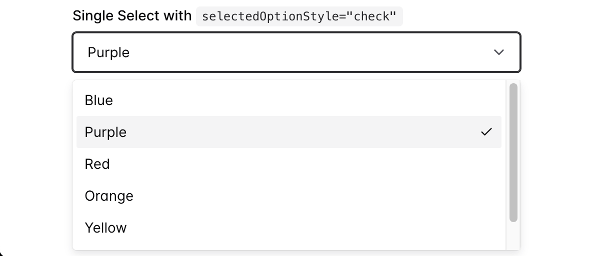
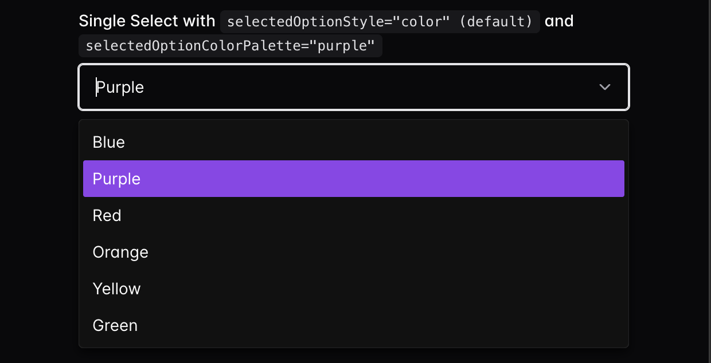

[CS-TS]:
  https://img.shields.io/badge/CodeSandbox-TypeScript-047bd4?logo=codesandbox&style=flat&labelColor=040404&logoColor=DBDBDB
  "CodeSandbox TypeScript Demo"
[CS-JS]:
  https://img.shields.io/badge/CodeSandbox-JavaScript-f4dc1b?logo=codesandbox&style=flat&labelColor=040404&logoColor=DBDBDB
  "CodeSandbox JavaScript Demo"
[SB-TS]:
  https://developer.stackblitz.com/img/open_in_stackblitz.svg
  "StackBlitz Demo"

# chakra-react-select v6

This component is a wrapper for the popular react component
[React Select](https://react-select.com/home) made using the UI library
[Chakra UI](https://v2.chakra-ui.com/).

> [!IMPORTANT]
>
> This version of `chakra-react-select` is updated for
> [Chakra UI v3](https://www.chakra-ui.com/docs/get-started/installation) which
> works exclusively with React version 18 or above. `chakra-react-select` v5,
> which is compatible with [Chakra UI v2](https://v2.chakra-ui.com/), will be
> maintained for the foreseeable future. If you're still using Chakra UI v2
> check
> [the docs for chakra-react-select v5 here](https://github.com/csandman/chakra-react-select/tree/v5).

[](https://github.com/csandman/chakra-react-select/actions/workflows/lint.yml?query=branch%3Amain)
[](https://www.npmjs.com/package/chakra-react-select)
[](https://bundlephobia.com/result?p=chakra-react-select)
[](https://bundlephobia.com/result?p=chakra-react-select)
[](https://npm-stat.com/charts.html?package=chakra-react-select&from=2021-09-13)
[](https://npm-stat.com/charts.html?package=chakra-react-select&from=2021-09-13)
[](https://snyk.io/test/github/csandman/chakra-react-select)
[](https://github.com/prettier/prettier)
[](LICENSE.md)

|                     Light Mode                      |                     Dark Mode                     |
| :-------------------------------------------------: | :-----------------------------------------------: |
|  |  |

Check out the demo here:

[![SB-TS]](https://stackblitz.com/edit/vitejs-vite-lzaqwr?file=src%2Fapp.tsx)

> [!NOTE]
>
> Before leaving an issue on this project, remember that this is just a
> _wrapper_ for `react-select`, not a standalone package. A large percentage of
> the questions people have end up being about how `react-select` itself works,
> so please read through their documentation to familiarize yourself with it!
> https://react-select.com/home

## Contents

- [Usage](#usage)
- [Extra Props](#extra-props)
  - [`size`](#size--options-responsivevaluesm--md--lg--default-md)
  - [`tagColorPalette`](#tagcolorpalette)
  - [`tagVariant`](#tagvariant--options-subtle--solid--outline--default-subtle)
  - [`invalid` / `readOnly`](#invalid--default-false--readonly---default-false)
  - [`focusRingColor`](#focusringcolor)
  - [`selectedOptionStyle`](#selectedoptionstyle--options-color--check--default-color)
  - [`selectedOptionColorPalette`](#selectedoptioncolorpalette--default-blue)
  - [`variant`](#variant--options-outline--filled--flushed--unstyled--default-outline)
- [Styling](#styling)
  - [`chakraStyles`](#chakrastyles)
    - [Caveats](#caveats)
    - [Examples](#examples)
  - [Theme Styles](#theme-styles)
  - [`className`](#classname)
- [TypeScript Support](#typescript-support)
- [Customizing Components](#customizing-components)
  - [Custom `LoadingIndicator` (Chakra `Spinner`)](#custom-loadingindicator-chakra-spinner)
- [`useChakraSelectProps`](#usechakraselectprops)
- [Usage with React Form Libraries](#usage-with-react-form-libraries)
  - [`react-hook-form`](#react-hook-form)
  - [`formik`](#formik)
- [Templates](#templates)
  - [CodeSandbox](#codesandbox)
  - [StackBlitz](#stackblitz)

## Usage

To use this package, you'll need to have `@chakra-ui/react@3` set up
[like in the guide in their docs](https://www.chakra-ui.com/docs/get-started/installation).

```sh
npm i @chakra-ui/react @emotion/react
# ...or...
yarn add @chakra-ui/react @emotion/react
```

After Chakra UI is set up,
[install this package from NPM](https://www.npmjs.com/package/chakra-react-select):

```sh
npm i chakra-react-select
# ...or...
yarn add chakra-react-select
```

Once installed, you can import the base select package, the async select, the
creatable select or the async creatable select like so:

```js
import {
  AsyncCreatableSelect,
  AsyncSelect,
  CreatableSelect,
  Select,
} from "chakra-react-select";
// ...or...
const {
  AsyncCreatableSelect,
  AsyncSelect,
  CreatableSelect,
  Select,
} = require("chakra-react-select");
```

All exports, including types, from the original `react-select` package are also
exported from this package, so you can import any of them if you need them. The
only exception is the root `Select` components.

Implementing this component in your application should be almost identical to
how you'd normally use [react-select](https://react-select.com/home). It will
accept all of the props that the original package does, with a few additions and
exceptions listed below. So if you have a question on basic usage, your best bet
is to check the original docs or google "How to (some functionality) with
react-select" and just swap out `react-select` for `chakra-react-select`.

## Extra Props

### `size` — Options: `ResponsiveValue<"sm" | "md" | "lg">` — Default: `md`

You can pass the `size` prop with either `sm`, `md`, or `lg` (default is `md`).
These will reflect the sizes available on the
[Chakra `<Input />` component](https://www.chakra-ui.com/docs/components/input)
(except for `xs` because it's too small to work). Alternatively, you can pass a
[responsive style array or object](https://www.chakra-ui.com/docs/styling/responsive-design)
of `size` values to allow it to change depending on your theme's breakpoints.

If no `size` is passed, it will default to `defaultProps.size` from the theme
for Chakra's `Input` component. If your component theme for `Input` is not
modified, it will be `md`.

```tsx
return (
  <>
    <Select size="sm" />
    <Select size="md" /> {/* Default */}
    <Select size="lg" />
  </>
);
```


---

### `tagColorPalette`

You can pass the `tagColorPalette` prop to the select component to change all of
the selected options tags' colors. You can view the whole list of available
color palettes in
[the Chakra docs](https://www.chakra-ui.com/docs/theming/colors), or if you have
a custom color palette, any of the custom color names in that will be available
instead.

Alternatively, you can add the `colorPalette` key to any of your options objects
and it will only style that option when selected.

```tsx
return (
  <Select
    {/* The global tag color palette */}
    tagColorPalette="purple"
    options={[
      {
        label: "I am red",
        value: "i-am-red",
        colorPalette: "red", // The option color palette overrides the global
      },
      {
        label: "I fallback to purple",
        value: "i-am-purple",
      },
    ]}
  />
);
```


---

### `tagVariant` — Options: `subtle` | `solid` | `outline` — Default: `subtle`

You can pass the `tagVariant` prop with either `subtle`, `solid`, or `outline`
(default is `subtle`). These will reflect the `variant` prop available on the
[Chakra `<Tag />` component](https://www.chakra-ui.com/docs/components/tag).
Alternatively, if you have added any custom variants to your theme, you can use
those instead.

Alternatively, you can add the `variant` key to any of your options objects and
it will only style that option when selected. This will override the
`tagVariant` prop on the select if both are set

```tsx
return (
  <Select
    {/* The global variant */}
    tagVariant="solid"
    options={[
      {
        label: "I have the outline style",
        value: "i-am-outlined",
        variant: "outline", // The option variant overrides the global
      },
      {
        label: "I fallback to the global `solid`",
        value: "i-am-solid",
      },
    ]}
  />
);
```


---

### `invalid` — Default: `false` | `readOnly` - Default: `false`

You can pass `invalid` to the select component to style it like the Chakra
`Input` is styled when it receives the same prop. Alternatively, you can pass
`readOnly` to make the component non-interactive in the same way Chakra's
`Input` does.

You can pass also pass `invalid`, `disabled`, or `readOnly` into a wrapping
`<FormControl />` to achieve the same result as passing these props into the
`Select` component.

```tsx
return (
  <>
    {/* This will show up with a red border */}
    <Select invalid />

    {/* This will show up normally but will not be interactive */}
    <Select readOnly />

    {/* This will show up grayed out and will not be interactive */}
    {/* Additionally, it will have a red border and the error message will be shown */}
    <FormControl invalid disabled>
      <FormLabel>Invalid & Disabled Select</FormLabel>
      <Select />
      <FormErrorMessage>
        This error message shows because of an invalid FormControl
      </FormErrorMessage>
    </FormControl>
  </>
);
```


---

### `focusRingColor`

The prop `focusRingColor` can be passed with Chakra color tokens which will
emulate style the control component when focused.

```tsx
return (
  <Select focusRingColor="blue.600" />
);
```


---

### `selectedOptionStyle` — Options: `color` | `check` — Default: `color`

As of `v1.3.0` you can pass the prop `selectedOptionStyle` with either `"color"`
or `"check"`. The default option `"color"` will style a selected option similar
to how react-select does it, by highlighting the selected option in the color
blue. Alternatively, if you pass `"check"` for the value, the selected option
will be styled like the
[Chakra UI `<Select />` component](https://www.chakra-ui.com/docs/components/select)
and include a check icon next to the selected option(s). If `isMulti` and
`selectedOptionStyle="check"` are passed, space will only be added for the check
marks if `hideSelectedOptions={false}` is also passed.

```js
return (
  <>
    <Select selectedOptionStyle="color" /> {/* Default */}
    <Select selectedOptionStyle="check" /> {/* Chakra UI Menu Style */}
  </>
);
```




---

### `selectedOptionColorPalette` — Default: `blue`

If you choose to stick with the default `selectedOptionStyle="color"`, you have
one additional styling option. If you do not like the default of blue for the
highlight color, you can pass the `selectedOptionColorPalette` prop to change
it. This prop will accept any named color from your theme's color palette, and
it will use the `500` value in light mode or the `300` value in dark mode.

> [!NOTE]
>
> This prop can only be used for named colors from your theme, not arbitrary
> hex/rgb colors. If you would like to use a specific color for the background
> that's not a part of your theme, use the [`chakraStyles`](#chakrastyles) prop
> to customize it (see
> [#99](https://github.com/csandman/chakra-react-select/discussions/99) for an
> example).

```tsx
return (
  <>
    <Select selectedOptionColorPalette="blue" /> {/* Default */}
    <Select selectedOptionColorPalette="purple" />
  </>
);
```




---

### `variant` — Options: `outline` | `subtle` — Default: `outline`

You can pass the `variant` prop with `outline` or `subtle` to change the overall
styling of the `Select`. These will reflect the various appearances available
for
[Chakra's `<Select />` component](https://www.chakra-ui.com/docs/components/select).
Alternatively, if you've added any custom variants to your Chakra theme you can
use those instead. However, it is not guaranteed all styles will be applied how
you intend them to as there are some differences in the structure of the
Select's input component.

If no `variant` is passed, it will default to `defaultProps.variant` from the
theme for Chakra's `Select` component. If your component recipe for `Select` is
not modified, it will be `outline`.

```tsx
return (
  <>
    <Select variant="outline" /> {/* Default */}
    <Select variant="filled" />
    <Select variant="flushed" />
    <Select variant="unstyled" />
  </>
);
```


---

If you have any other requests for Chakra-like features that could be added via
custom props, or problems with the current features,
[please start a discussion](https://github.com/csandman/chakra-react-select/discussions/categories/ideas)!

## Styling

There are a few ways to style the components that make up `chakra-react-select`.
It's important to note that this package does not use the `theme` or `styles`
props that are implemented in `react-select`. The `theme` prop isn't used as
most of the components' base styles are pulling from your Chakra theme, and
[customizing your base theme (such as colors or component styles) should in turn change the styles in this package.](#theme-styles)

This package does however offer an alternative to the `styles` prop,
`chakraStyles`. It mostly emulates the behavior of the original `styles` prop,
however, because it’s not identical it is named differently to prevent
confusion.

### `chakraStyles`

To use the `chakraStyles` prop, first, check the documentation for
[the original `styles` prop from the react-select docs](https://react-select.com/styles#style-object).
This package offers an identical API for the `chakraStyles` prop, however, the
`provided` and output style objects use
[Chakra's `css` prop](https://v2.chakra-ui.com/docs/styled-system/the-sx-prop)
instead of the default emotion styles the original package offers. This allows
you to both use the shorthand styling props you'd normally use to style Chakra
components, as well as tokens from your theme such as named colors.

The API for an individual style function looks like this:

```js
/**
 * @param {SystemStyleObject} provided -- The component's default Chakra styles
 * @param {Object} state -- The component's current state e.g. `isFocused` (this gives all of the same props that are passed into the component)
 * @returns {SystemStyleObject} An output style object which is forwarded to the component's `sx` prop
 */
function option(provided, state) {
  return {
    ...provided,
    color: state.isFocused ? "blue.500" : "red.400",
  };
}
```

All of the style keys offered in the original package can be used in the
`chakraStyles` prop except for `menuPortal`. Along with
[some other caveats](#caveats), this is explained below.

Most of the components rendered by this package use the basic
[Chakra `<Box />` component](https://v2.chakra-ui.com/docs/components/box) with
a few exceptions. Here are the style keys offered and the corresponding Chakra
component that is rendered:

- `clearIndicator` - `Box` (uses theme styles for Chakra's
  `select.clearTrigger`)
- `container` - `Box` (uses theme styles for Chakra's `select.root`)
- `control` - `Box` (uses theme styles for Chakra's `input`)
- `dropdownIndicator` - `Box` (uses theme styles for Chrakra's
  `select.indicator`)
- `downChevron` - `chakra.svg` (copied from
  [`icons.tsx`](https://github.com/chakra-ui/chakra-ui/blob/main/packages/react/src/components/icons.tsx))
- `crossIcon` - `chakra.svg` (copied from
  [`icons.tsx`](https://github.com/chakra-ui/chakra-ui/blob/main/packages/react/src/components/icons.tsx))
- `group` - `Box` (uses theme styles for Chakra's `select.itemGroup`)
- `groupHeading` - `Box` (uses theme styles for Chakra's
  `select.itemGroupLabel`)
- `indicatorsContainer` - `Box` (uses theme styles for Chakra's
  `select.indicatorGroup`)
- `indicatorSeparator` - `Separator`
- `input` - `chakra.input` (wrapped in a `Box`)
- `inputContainer` - `Box`
- `loadingIndicator` - `Spinner`
- `loadingMessage` - `Box`
- `menu` - `Box`
- `menuList` - `Box` (uses theme styles for Chakra's `select.content`)
- `multiValue` - `Tag.Root`
- `multiValueLabel` - `Tag.Label`
- `multiValueRemove` - `Tag.EndElement` (there is a `Tag.CloseTrigger` rendered
  inside of it, so you can target it using a nested selector)
- `noOptionsMessage` - `Box`
- `option` - `Box` (uses theme styles for Chakra's `select.item`)
- `placeholder` - `Box`
- `singleValue` - `Box`
- `valueContainer` - `Box`

If you're using TypeScript, the `chakraStyles` prop is defined by the exported
`ChakraStylesConfig` interface.

```tsx
import { ChakraStylesConfig, Select } from "chakra-react-select";

const App: React.FC = () => {
  const chakraStyles: ChakraStylesConfig = {
    dropdownIndicator: (provided, state) => ({
      ...provided,
      background: state.isFocused ? "blue.100" : provided.background,
      p: 0,
      w: "40px",
    }),
  };

  return <Select chakraStyles={chakraStyles} />;
};
```

#### Caveats

One change between the keys in the `chakraStyles` prop and the original `styles`
prop, is that in the original the `input` styles apply to a container
surrounding the HTML `<input />` element, and there is no key for styling the
input itself. With the `chakraStyles` object, the `input` key now styles the
actual `<chakra.input />` element and there is a new key, `inputContainer`, that
styles the surrounding `Box`. Both functions use the `state` argument for the
original `input` key.

There are also two extra style keys for the icons contained within the
indicators that are not offered in the original package. These are `downChevron`
which is contained inside the `DropdownIndicator`, and the `crossIcon` which is
contained inside the `ClearIndicator`. Both styles receive the same `state`
values as their containing indicators. These style keys were added as a
convenience, however you could also apply the same styles using the parent
`chakraStyles` by doing something like this:

```js
const chakraStyles = {
  dropdownIndicator: (prev, { selectProps }) => ({
    ...prev,
    "> svg": {
      transform: `rotate(${selectProps.menuIsOpen ? -180 : 0}deg)`,
    },
  }),
};
```

[![SB-TS]](https://stackblitz.com/edit/vitejs-vite-o6ugku?file=src%2Fapp.tsx)

Additionally, there is one key that is available in the `styles` prop that does
not exist in the `chakraStyles` object; `menuPortal`. This key applies to the
`MenuPortal` element which is only used when the
[`menuPortalTarget`](https://react-select.com/advanced#portaling) prop is passed
in. This component is replaceable, however, it is very tightly integrated with
the menu placement logic (and a context provider) so it appears to be impossible
to fully replace it with a chakra component. And in turn, it can't pull a key
from the `chakraStyles` prop. Therefore, if you are passing the
`menuPortalTarget` prop and would like to change the styles of the `MenuPortal`
component, you have two options:

1. Pass the original `styles` prop with the `menuPortal` key. This is the only
   key in the `styles` object that will be applied to your components.

```tsx
return (
  <Select
    menuPortalTarget={document.body}
    styles={{
      menuPortal: (provided) => ({ ...provided, zIndex: 100 }),
    }}
    chakraStyles={{
      // All other component styles
    }}
  />
);
```

2. Pass the `classNamePrefix` prop [as described below]() and style the
   `MenuPortal` with CSS using the className `prefix__menu-portal`.

```tsx
// example.js
import "styles.css";

return (
  <Select
    menuPortalTarget={document.body}
    classNamePrefix="crs"
  />
);
```

```css
/* styles.css */

.crs__menu-portal {
  z-index: 100;
}
```

If anyone has any suggestions for how to fully replace the `MenuPortal`
component, please leave a comment on
[this issue](https://github.com/csandman/chakra-react-select/issues/55) or
submit a pull request.

#### Examples

Dropdown menu attached to control example:

[![SB-TS]](https://stackblitz.com/edit/vitejs-vite-nh58wg?file=src%2Fapp.tsx)

### Theme Styles

As mentioned above, a few of the custom components this package implements
either use styles from the global
[Chakra component recipes](https://www.chakra-ui.com/docs/theming/customization/recipes)
or are themselves those components. As this package pulls directly from your
Chakra theme, any changes you make to those components' themes will propagate to
the components in this package.

> [!NOTE]
>
> Some of the theme styles are manually overridden when this package implements
> them. This is not as common as it used to be with Chakra V2 due to most styles
> being pulled from the `Select` slot recipe now, but there are a few other
> cases where this exception applies. There is no alternative to this currently,
> so if your custom theme styles are not being applied correctly please use
> [`chakraStyles`](#chakrastyles) to style your components instead.
> `chakraStyles` always takes the highest priority in overriding the styles of a
> component.

Here is a list of all components that will be affected by changes to your theme:

| `react-select` component | `chakra-ui`                                                                                                                                                                                                                                                                         |
| ------------------------ | ----------------------------------------------------------------------------------------------------------------------------------------------------------------------------------------------------------------------------------------------------------------------------------- |
| `ClearIndicator`         | [`select.clearTrigger`](https://github.com/chakra-ui/chakra-ui/blob/main/packages/react/src/theme/recipes/select.ts)                                                                                                                                                                |
| `Control`                | [`input`](https://github.com/chakra-ui/chakra-ui/blob/main/packages/react/src/theme/recipes/input.ts)                                                                                                                                                                               |
| `DropdownIndicator`      | [`select.indicator`](https://github.com/chakra-ui/chakra-ui/blob/main/packages/react/src/theme/recipes/select.ts)                                                                                                                                                                   |
| `Group`                  | [`select.itemGroup`](https://github.com/chakra-ui/chakra-ui/blob/main/packages/react/src/theme/recipes/select.ts)                                                                                                                                                                   |
| `GroupHeading`           | [`select.itemGroupLabel`](https://github.com/chakra-ui/chakra-ui/blob/main/packages/react/src/theme/recipes/select.ts)                                                                                                                                                              |
| `IndicatorsContainer`    | [`select.indicatorGroup`](https://github.com/chakra-ui/chakra-ui/blob/main/packages/react/src/theme/recipes/select.ts)                                                                                                                                                              |
| `LoadingIndicator`       | [`spinner`](https://github.com/chakra-ui/chakra-ui/blob/main/packages/react/src/theme/recipes/spinner.ts)                                                                                                                                                                           |
| `MenuList`               | [`select.content`](https://github.com/chakra-ui/chakra-ui/blob/main/packages/react/src/theme/recipes/select.ts)                                                                                                                                                                     |
| `MultiValueContainer`    | [`tag.root`](https://github.com/chakra-ui/chakra-ui/blob/main/packages/react/src/theme/recipes/tag.ts)                                                                                                                                                                              |
| `MultiValueLabel`        | [`tag.label`](https://github.com/chakra-ui/chakra-ui/blob/main/packages/react/src/theme/recipes/tag.ts)                                                                                                                                                                             |
| `MultiValueRemove`       | [`tag.endElement` / `tag.closeTrigger`](https://github.com/chakra-ui/chakra-ui/blob/main/packages/react/src/theme/recipes/tag.ts) (this is a special case, because the `MultiValueRemove` renders both the `Tag.EndElement` as well as the `Tag.CloseTrigger` as it's direct child) |
| `Option`                 | [`select.item`](https://github.com/chakra-ui/chakra-ui/blob/main/packages/react/src/theme/recipes/select.ts)                                                                                                                                                                        |
| `SelectContainer`        | [`select.root`](https://github.com/chakra-ui/chakra-ui/blob/main/packages/react/src/theme/recipes/select.ts)                                                                                                                                                                        |

In addition to specific component styles, any changes you make to your global
color palette will also be reflected in these custom components.

> [!NOTE]
>
> Only make changes to your global component themes if you want them to appear
> in all instances of that component. Otherwise, just change the individual
> components' styles using the `chakraStyles` prop.

### `className`

This package implements the same classNames on the sub components as the
original package so you can use these to style sub-components with CSS. Here is
an excerpt from
[the react-select docs](https://react-select.com/styles#using-classnames)
describing how it works:

> If you provide the `className` prop to react-select, the SelectContainer will
> be given a className based on the provided value.
>
> If you provide the `classNamePrefix` prop to react-select, all inner elements
> will be given a className with the provided prefix.
>
> For example, given `className='react-select-container'` and
> `classNamePrefix="react-select"`, the DOM structure is similar to this:
>
> ```html
> <div class="react-select-container">
>   <div class="react-select__control">
>     <div class="react-select__value-container">...</div>
>     <div class="react-select__indicators">...</div>
>   </div>
>   <div class="react-select__menu">
>     <div class="react-select__menu-list">
>       <div class="react-select__option">...</div>
>     </div>
>   </div>
> </div>
> ```
>
> While we encourage you to use the new Styles API, you still have the option of
> styling via CSS classes. This ensures compatibility with
> [styled components](https://www.styled-components.com/),
> [CSS modules](https://github.com/css-modules/css-modules) and other libraries.

Here is an example of using classNames to style the components:

[![SB-TS]](https://stackblitz.com/edit/vitejs-vite-zupcmm?file=src%2Fapp.tsx,src%2Fstyles.css)

## TypeScript Support

This package has always supported typescript, however until `v3.0.0` none of the
type inference was working on the props passed into this component. Now that
they are, you may need to pass in some generics for your component to be typed
properly, but **in most cases you shouldn't need to because their types should
be inferred**. Here is a snippet from the original documentation on the subject:

> ### Select generics
>
> There are three generics used by the Select component: `Option`, `IsMulti`,
> and `Group`. All of them are optional and TypeScript attempts to detect them
> automatically, but sometimes it might need some help. Many of the
> `react-select` types include the three generics like this:
>
> — https://react-select.com/typescript

Read their [full documentation](https://react-select.com/typescript) on the
topic for more info.

This package exports all of the named module members of the original
`react-select` in case you need their built-in types in any of your variable
declarations. The root select `Props` type that is exported by `react-select`
has been extended using module
augmentation,<sup>[[1]](https://react-select.com/typescript#custom-select-props)</sup><sup>[[2]](https://github.com/JedWatson/react-select/issues/4804#issuecomment-927223471)</sup>
so if you import that type it will include all of the extra props offered. This
package also exports a few custom types that are specific to the custom props
offered by this package:

- `ChakraStylesConfig<Option, IsMulti, Group>` — The type for the prop
  `chakraStyles` that can be passed to customize the component styles. This is
  almost identical to the built-in `StylesConfig` type, however, it uses
  Chakra's
  [`SystemStyleObject`](https://github.com/chakra-ui/chakra-ui/blob/v2/packages/styled-system/src/system.types.ts#L80)
  type instead of react-select's emotion styles. It also has the same three
  generics as your `Select` component which would be required if you define your
  styles separately from your component.
- `OptionBase` — A type for your individual select options that includes the
  custom props for styling each of your selected options. This type is made to
  give you a base to extend off of and pass in as a generic to the root `Select`
  component.
- Each of the four Select components has a type exported with it:
  - `SelectComponent`
  - `AsyncSelectComponent`
  - `CreatableSelectComponent`
  - `AsyncCreatableSelectComponent`

Here is an example of how to pass in the proper generics to
`chakra-react-select`:

````ts
import { GroupBase, OptionBase, Select } from "chakra-react-select";

/**
 * `OptionBase` is a custom type exported by this package meant to be extended
 * to make your custom option types. It includes all of the keys that can be
 * used by this package to customize the styles of your selected options
 *
 * ```
 * interface OptionBase {
 *   variant?: string;
 *   colorPalette?: string;
 *   disabled?: boolean;
 * };
 * ```
 */
interface ColorOption extends OptionBase {
  label: string;
  value: string;
}

const colorOptions = [
  {
    label: "Red",
    value: "red",
    colorPalette: "red", // This is allowed because of the key in the `OptionBase` type
  },
  {
    label: "Blue",
    value: "blue",
  }
]

function CustomMultiSelect() {
  return {
    <Select<ColorOption, true, GroupBase<ColorOption>> // <-- None of these generics should be required
      isMulti
      name="colors"
      options={colorOptions}
      placeholder="Select some colors..."
    />
  }
}
````

## Customizing Components

Like the original `react-select`, this package exports all of the custom
components that make up the overall select. However, instead of being exported
as `components` they are exported as `chakraComponents` to leave the original
`components` export from react-select alone (you can export that as well if
you'd like). When implementing this component, you have the option to wrap these
components and alter their state and the children they return
[in the same way the original does](https://react-select.com/components#defining-components).

It's important to note, however, that there are 3 components offered in the
original `react-select` that are missing from `chakraComponents`. These are the
`CrossIcon`, `DownChevron`, and `MenuPortal`. The `MenuPortal` could not be
replaced at all [as mentioned earlier](#caveats), so if you'd like to customize
it, use the original from the `components` import. The icons posed issues with
prop compatibility when passing them into the core `Select` so the easiest way
to replace them would be to use a custom `DropdownIndicator` or `ClearIndicator`
and pass custom icons in as children:

```tsx
import { CloseIcon, TriangleDownIcon } from "@chakra-ui/icons";
import { chakraComponents } from "chakra-react-select";

const components: SelectComponentsConfig<Option, true, GroupBase<Option>> = {
  ClearIndicator: (props) => (
    <chakraComponents.ClearIndicator {...props}>
      <CloseIcon />
    </chakraComponents.ClearIndicator>
  ),
  DropdownIndicator: (props) => (
    <chakraComponents.DropdownIndicator {...props}>
      <TriangleDownIcon />
    </chakraComponents.DropdownIndicator>
  ),
};
```

[![SB-TS]](https://stackblitz.com/edit/vitejs-vite-a8zme3?file=src%2Fapp.tsx)

Here's a complete example of how you might use custom components to create a
select with a custom `Option`:

```tsx
import { Icon, TagLeftIcon } from "@chakra-ui/react";
import {
  type GroupBase,
  Select,
  type SelectComponentsConfig,
  chakraComponents,
} from "chakra-react-select";
import {
  GiCherry,
  GiChocolateBar,
  GiCoffeeBeans,
  GiStrawberry,
} from "react-icons/gi";

interface FlavorOption {
  label: string;
  value: string;
  Icon: React.FC;
  iconColor: string;
}

const flavorOptions: FlavorOption[] = [
  {
    value: "coffee",
    label: "Coffee",
    Icon: GiCoffeeBeans,
    iconColor: "orange.700",
  },
  {
    value: "chocolate",
    label: "Chocolate",
    Icon: GiChocolateBar,
    iconColor: "yellow.800",
  },
  {
    value: "strawberry",
    label: "Strawberry",
    Icon: GiStrawberry,
    iconColor: "red.500",
  },
  {
    value: "cherry",
    label: "Cherry",
    Icon: GiCherry,
    iconColor: "red.600",
  },
];

const customComponents: SelectComponentsConfig<
  FlavorOption,
  true,
  GroupBase<FlavorOption>
> = {
  Option: ({ children, ...props }) => (
    <chakraComponents.Option {...props}>
      <Icon
        as={props.data.Icon}
        color={props.data.iconColor}
        mr={2}
        h={5}
        w={5}
      />
      {children}
    </chakraComponents.Option>
  ),
  MultiValueContainer: ({ children, ...props }) => (
    <chakraComponents.MultiValueContainer {...props}>
      <TagLeftIcon as={props.data.Icon} color={props.data.iconColor} />
      {children}
    </chakraComponents.MultiValueContainer>
  ),
};

const App = () => (
  <Select
    isMulti
    name="flavors"
    options={flavorOptions}
    placeholder="Select some flavors..."
    components={customComponents}
  />
);
```

[![SB-TS]](https://stackblitz.com/edit/vitejs-vite-jgfakl?file=src%2Fapp.tsx)

### Custom `LoadingIndicator` (Chakra `Spinner`)

For most sub components, the styling can be easily accomplished using the
[`chakraStyles`](#chakrastyles) prop. However, in the case of the
`LoadingIndicator` there are a few props which do not directly correlate very
well with styling props. To solve that problem, the
`chakraComponents.LoadingIndicator` component can be passed a few extra props
which are normally available on the Chakra UI
[`Spinner`](https://v2.chakra-ui.com/docs/components/spinner). Here is an
example demonstrating which extra props are offered:

```tsx
import { AsyncSelect, chakraComponents } from "chakra-react-select";

// These are the defaults for each of the custom props
const asyncComponents = {
  LoadingIndicator: (props) => (
    <chakraComponents.LoadingIndicator
      // The color palette of the filled in area of the spinner (there is no default)
      colorPalette="gray"
      // The color of the main line which makes up the spinner
      // This could be accomplished using `chakraStyles` but it is also available as a custom prop
      color="currentColor" // <-- This default's to your theme's text color (Light mode: gray.700 | Dark mode: whiteAlpha.900)
      // The color of the remaining space that makes up the spinner
      trackColor="transparent"
      // The `size` prop on the Chakra spinner
      // Defaults to one size smaller than the Select's size
      spinnerSize="md"
      // A CSS <time> variable (s or ms) which determines the time it takes for the spinner to make one full rotation
      animationDuration="500ms"
      // A CSS size string representing the thickness of the spinner's line
      borderWidth="2px"
      // Don't forget to forward the props!
      {...props}
    />
  ),
};

const App = () => (
  <AsyncSelect
    isMulti
    name="colors"
    placeholder="Select some colors..."
    components={asyncComponents}
    loadOptions={(inputValue, callback) => {
      setTimeout(() => {
        const values = colorOptions.filter((i) =>
          i.label.toLowerCase().includes(inputValue.toLowerCase())
        );
        callback(values);
      }, 1500);
    }}
  />
);
```

[![SB-TS]](https://stackblitz.com/edit/lyyatb?file=src%2Fapp.tsx)

## `useChakraSelectProps`

Being a wrapper for `react-select`, all of the customizations done to
react-select are passed in as props. There is a hook,
[`useChakraSelectProps`](https://github.com/csandman/chakra-react-select/blob/main/src/use-chakra-select-props.ts)
that handles merging any extra customizations from the end user with the
customizations done by this package. In some cases you may simply want to use
this hook to get the custom props and pass them into a `react-select` instance
yourself.

To do so, simply import the hook from this package, and call it by passing in
any extra custom props you'd like into it and spread it onto a base
`react-select` component:

```tsx
import { useState } from "react";
import { useChakraSelectProps } from "chakra-react-select";
import Select from "react-select";
import { options } from "./data";

const CustomSelect = () => {
  const [selectedOptions, setSelectedOptions] = useState([]);

  const selectProps = useChakraSelectProps({
    isMulti: true,
    value: selectedOptions,
    onChange: setSelectedOptions,
  });

  return <Select {...selectProps} />;
};
```

One important thing to note however, is that this hook generally adds no benefit
if you're just going to pass the props it returns into the core `Select`
component from this package. The only time it really becomes useful is if you're
passing the resulting props into the core `react-select` component, or another
component that wraps it.

One example of how you might use this is to customize the component
`react-google-places-autocomplete`, which is an autocomplete dropdown for Google
Places that uses the `AsyncSelect` from `react-select` as it's core. Therefore,
it accepts all of the same select props as the core react-select does meaning
you can use the `useChakraSelectProps` hook to style it:

```tsx
import { useState } from "react";
import { useChakraSelectProps } from "chakra-react-select";
import GooglePlacesAutocomplete from "react-google-places-autocomplete";

const GooglePlacesAutocomplete = () => {
  const [place, setPlace] = useState(null);

  const selectProps = useChakraSelectProps({
    value: place,
    onChange: setPlace,
  });

  return (
    <GooglePlacesAutocomplete
      apiKey="YOUR API KEY HERE"
      selectProps={selectProps}
    />
  );
};

export default GooglePlacesAutocomplete;
```

> [!NOTE]
>
> An API key would be needed to create a CodeSandbox example for this so you
> will have to implement it in your own project if you'd like to test it out.

## Usage with React Form Libraries

_This section is a work in progress, check back soon for more examples_

This package can be used with form controllers such as Formik or React Hook Form
in the same way you would with the original React Select, and the quickest way
to figure out how to do so would be to Google something along the lines of
"react-select with formik/react-hook-form/etc" and replace the `react-select`
component in those examples with a `chakra-react-select` component. However,
here are a few examples to help you get started. If you'd like to see examples
using other form providers, you can
[submit it as a Q&A discussion](https://github.com/csandman/chakra-react-select/discussions/categories/q-a).

### [`react-hook-form`](https://react-hook-form.com/)

See this issue for some discussion about using this package with
`react-hook-form`: https://github.com/csandman/chakra-react-select/issues/7

By default, `react-hook-form` uses
[uncontrolled components](https://reactjs.org/docs/uncontrolled-components.html)
to reduced input renders however this only works for native HTML inputs. Because
chakra-react-select is not a native HTML input, you'll need to use
react-hook-form's
[`Controller`](https://react-hook-form.com/api/usecontroller/controller)
component or [`useController`](https://react-hook-form.com/api/usecontroller)
hook in order to keep the value(s) tracked in `react-hook-form`'s state. Here
are some examples using each:

> [!NOTE]
>
> These examples still need to be updated to the newest version of
> `chakra-react-select` at some point, but they should still give you a good
> idea of how to implement what you want.

---

#### `Controller` multi select with built-in validation

[![CS-JS]](https://codesandbox.io/s/chakra-react-select-react-hook-form-controller-v7llc?file=/example.js)
[![CS-TS]](https://codesandbox.io/s/chakra-react-select-react-hook-form-controller-typescript-v8ps5?file=/app.tsx)

---

#### `useController` multi select with built-in validation

[![CS-JS]](https://codesandbox.io/s/chakra-react-select-react-hook-form-usecontroller-n8wuf?file=/example.js)
[![CS-TS]](https://codesandbox.io/s/chakra-react-select-react-hook-form-usecontroller-typescript-qcm23?file=/app.tsx)

---

#### `useController` single select

[![CS-JS]](https://codesandbox.io/s/chakra-react-select-react-hook-form-usecontroller-single-select-vanilla-js-11x4zk?file=/example.js)
[![CS-TS]](https://codesandbox.io/s/chakra-react-select-react-hook-form-usecontroller-single-select-typescript-vylckh?file=/app.tsx)

---

#### Multi select with [`yup`](https://github.com/jquense/yup) validation (advanced example)

[![CS-JS]](https://codesandbox.io/s/chakra-react-select-react-hook-form-with-yup-validation-tno8v?file=/src/app.js)
[![CS-TS]](https://codesandbox.io/s/chakra-react-select-react-hook-form-with-yup-validation-typescript-n7slhu?file=/app.tsx)

---

#### Single select with [`yup`](https://github.com/jquense/yup) validation (advanced example)

[![CS-JS]](https://codesandbox.io/s/chakra-react-select-single-react-hook-form-with-yup-validation-y5kjc1?file=/src/app.js)
[![CS-TS]](https://codesandbox.io/s/chakra-react-select-single-react-hook-form-with-yup-validation-typescript-phmv0u?file=/app.tsx)

---

#### Multi select with [`zod`](https://github.com/colinhacks/zod) validation (advanced example)

[![CS-JS]](https://codesandbox.io/s/chakra-react-select-react-hook-form-with-zod-validation-cu0rku?file=/src/app.js)
[![CS-TS]](https://codesandbox.io/s/chakra-react-select-react-hook-form-with-zod-validation-typescript-5fyhfh?file=/app.tsx)

---

#### Single select with [`zod`](https://github.com/colinhacks/zod) validation (advanced example)

[![CS-JS]](https://codesandbox.io/s/chakra-react-select-single-react-hook-form-with-zod-validation-jd588n?file=/src/app.js)
[![CS-TS]](https://codesandbox.io/s/chakra-react-select-single-react-hook-form-with-zod-validation-typescript-m1dqme?file=/app.tsx)

---

### [`formik`](https://formik.org/)

See this discussion for some examples of using this package with `formik`:
https://github.com/csandman/chakra-react-select/discussions/111

#### Single select with built-in validation

- Vanilla JS: _coming soon_
- TypeScript: _coming soon_

#### Multi select with built-in validation

- Vanilla JS: _coming soon_
- TypeScript: _coming soon_

#### Multi select with `yup` validation

- Vanilla JS: _coming soon_
- TypeScript: _coming soon_

## Advanced Examples

There are some pretty interesting ways you can customize an instance of
`chakra-react-select`, so here are a few examples of some of the more advanced
customizations.

- Select in a Popover:
  https://stackblitz.com/edit/vitejs-vite-cf6hiq?file=src%2Fapp.tsx
- Drag to Reorder Tags Multi Select (WIP):
  https://stackblitz.com/edit/vitejs-vite-wykymv?file=src%2Fmulti-select-sort.tsx

## Templates

When submitting a bug report, please include a minimum reproduction of your
issue using one of these templates:

- Vanilla JS Starter:
  https://stackblitz.com/edit/vitejs-vite-fatlrb?file=src%2Fapp.jsx
- TypeScript Starter:
  https://stackblitz.com/edit/vitejs-vite-evghcw?file=src%2Fapp.tsx
